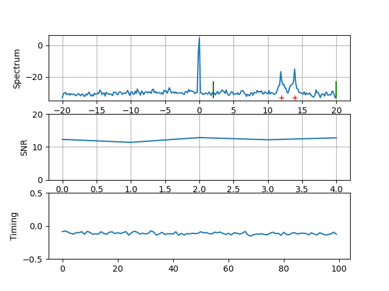

# Pi Radio IP

Minimal hardware IP over VHF/UHF Radio using RpiTx and RTLSDRs [1].


# Project Plan and Status

Currently working on M4 -Over The Air (OTA) tests.

| Milestone | Description | Comment |
| --- | --- | --- |
| M1 | ~~Proof of Concept Physical Layer~~ |
| M2 | ~~Git repo for project, integrated tx and rx applications~~ |
| M3 | ~~Simple GUI Dashboard that can be used to tune and debug link~~ |
| M4 | ~~first OTA tests using uncoded modem~~ | repeat after recent tuning - demo an OTA link with margin |
| M5 | ~~Pi running Tx and Rx~~ | Half duplex, loopback demo would be neat |
| M6 | ~~Add LDPC FEC to waveform~~ | Needs to be tested/tuned OTA |
| M7 | ~~Bidirectional half duplex Tx/Rx on single Pi~~ | frame repeater (ping) application developed and tested on the bench | 
| M8 | TAP/TUN integration and demo IP link | What protocol? |
| M9 | Document how to build simple wire antennas | |

# Building

This procedure builds everything locally, so won't interfere with any installed versions of the same software.

## RpiTx Transmitter

ssh into your Pi, then:
```
$ git clone https://github.com/drowe67/pirip.git
$ cd pirip
$ ./build_codec2.sh
$ ./build_rpitx.sh
$ cd tx && make
```

## RTLSDR FSK Receiver

On your laptop/PC:
```
$ sudo apt update
$ sudo apt install libusb-1.0-0-dev git cmake
$ ./build_codec2.sh
$ ./build_csdr.sh
$ ./build_rtlsdr.sh
```

# Testing

1. Transmit two tone test signal for Pi:
   ```
   pi@raspberrypi:~/pirip/tx $ sudo ./rpitx_fsk -t /dev/null
   ```
1. Transmit test frames from Pi for 60 seconds:
   ```
   pi@raspberrypi:~/pirip/tx $ ../codec2/build_linux/src/fsk_get_test_bits - 600000 | sudo ./rpitx_fsk -
   ```
1. Receive test frames on x86 laptop for 5 seconds (vanilla rtl_sdr):
   ```
   ~/pirip$ Fs=240000; librtlsdr/build_rtlsdr/src/rtl_sdr -g 49 -s $Fs -f 144490000 - | codec2/build_linux/src/fsk_demod --fsk_lower 500 --fsk_upper 25000 -d -p 24 2 240000 10000 - - | codec2/build_linux/src/fsk_put_test_bits -

1.  Receive test frames on x86 laptop for 5 seconds (vanilla rtl_sdr at Fs=1.8MHz):
   ```
   Fs=1800000; ./src/rtl_sdr -g 49 -s $Fs -f 144500000 - | csdr convert_u8_f | csdr fir_decimate_cc 45 | csdr convert_f_s16 | ../../codec2/build_linux/src/fsk_demod --fsk_lower 500 -c 2 40000 1000 - - | ../../codec2/build_linux/src/fsk_put_test_bits -

   ```
1. Receive test frames on x86 laptop for 5 seconds (integrated rtl_fsk):
   ```
   ~/pirip$  Fs=240000; tsecs=5; ./librtlsdr/build_rtlsdr/src/rtl_fsk -g 49 -f 144490000 - -n $(($Fs*$tsecs)) | codec2/build_linux/src/fsk_put_test_bits -
   ```
   Note this is tuned about 10kHz low, to put the two tones above the rtl_sdr DC line.  
1. Demod GUI Dashboard. Open a new console and start `dash.py`:
   ```
   ~/pirip$ netcat -luk 8001 | ./script/dash.py
   ```
   In another console start the FSK demod:
   ```
   ~/pirip$ Fs=240000; tsecs=20; ./librtlsdr/build_rtlsdr/src/rtl_fsk -g 1 -f 144490000 - -n $(($Fs*$tsecs)) -u localhost | codec2/build_linux/src/fsk_put_test_bits -
   ```
   
1. Automated loopback tests.  Connect your Pi to your RTLSDR via a 60dB attenuator

   Using vanilla `rtl_sdr`:
   ```
   ./test/loopback_rtl_sdr.sh
   ```
   Using integrated `rtl_fsk`:
   ```
   ./test/loopback_rtl_fsk.sh
   ```
   You can monitor `loopback_rtl_fsk.sh` using `dash.py` as above.

1. Using a HackRF as a transmitter, useful for bench testing the link.  The relatively low levels out of the HackRF make MDS testing easier compared to attenuating the somewhat stronger signal from the Pi.
   This example generates 1000 bit/s FSK with a 2000Hz shift:
   ```
   cd codec2/build_linux/src
   ./fsk_get_test_bits - 60000 | ./fsk_mod -c -a 30000 2 40000 1000 1000 2000 - - | ../misc/tlininterp - t.iq8 100 -d -f
   ```
   The output samples are at a sample rate of 4MHz, and a frequency offset of +1 MHz.  They can be played out of the HackRF with:
   ```
   hackrf_transfer -t t.iq8 -s 4E6 -f 143.5E6
   ```
   The signal will be centred on 144.5 MHz (143.5 + 1 MHz offset).

   You can receive it with:
   ```
   ./rtl_fsk -w 500E3 -e ff8 -r 1000 -f 144490000 - -u localhost | ~/pirip/codec2/build_linux/src/fsk_put_test_bits -
   ```

1. Noise Figure Testing

   Connect a signal generator to the input of the RTLSDR.  Set the frequency to 144.5MHz, and amplitude to -100dBm.

   The following command pipes the RTL output to an Octave script to measure noise figure.  You need the CSDR tools and Octave installed:
   ```
   $ cd ~/pirip/rtl-sdr-blog/build_rtlsdr/src
   $ ./rtl_sdr -g 50 -s 2400000 -f 144.498E6 - | csdr convert_u8_f | csdr fir_decimate_cc 50 | csdr convert_f_s16 | octave --no-gui -qf ~/pirip/codec2/octave/nf_from_stdio.m 48000 complex

   ```
   A few Octave plot windows will pop up.  Adjust your signal generator frequency so the sine wave is between 2000 and 4000, the
   script will print the Noise Figure (NF).  Around 6.5 dB was obtained using RTL-SDR.COM V3s using"-g 50"
   
   See also codec2/octave/nf_from_stdio.m and [Measuring SDR Noise Figure in Real Time](http://www.rowetel.com/?page_id=6172).

1. Running Rx on Pi:  This example 10 kbit/s, dashboard running on laptop 192.168.1.100
   ```
   ./rtl_fsk -s 2400000 -a 80000 -w 500E3 -e ff8 -r 10000 -f 144490000 - -u 192.168.1.100 | ~/pirip/codec2/build_linux/src/fsk_put_test_bits -

   ```

1. FSK with LDPC and framer at 1000 bit/s.  On the Pi Tx, we use an external source of test frames:
   ```
   $ cd ~/pirip/tx
   $ ../codec2/build_linux/src/fsk_get_test_bits - 2560 256 | sudo ./rpitx_fsk - --code H_256_512_4 -r 1000 -s 1000
   ```
   Laptop Rx:
   ```
   $ cd ~/pirip/librtlsdr/build_rtlsdr
   $ ./src/rtl_fsk -g 49 -f 144490000 - -r 1000 --code  H_256_512_4 -v -u localhost > /dev/null
   ```
   In this example we aren't counting errors in the received frames, but you can get some indication from the
   number of "iters" - if it's just 1 the FEC decoded isn't working very hard.
   
1. FSK with LDPC and framer at 10000 bit/s, internal test frames.  On the Pi Tx:
   ```
   $ sudo ./rpitx_fsk /dev/zero --code H_256_512_4 -r 10000 -s 10000 --testframes 10
   ```
   Laptop Rx:
   ```
   $ cd ~/pirip/librtlsdr/build_rtlsdr
   $ ./src/rtl_fsk -g 1 -f 144490000 - -a 100000 -r 10000 --code  H_256_512_4 -v -u localhost --testframes > /dev/null
   ```
   When the Pi transmits a burst, you'll see something like:
   ```
   721 nbits:  28 state: 1 uw_loc:  58 uw_err:  5 bad_uw: 0 snrdB:  7.4 eraw:  36 ecdd:   0 iter:   9 pcc: 256 rxst: -BS-
   722 nbits:  34 state: 1 uw_loc:  58 uw_err:  2 bad_uw: 0 snrdB:  6.4 eraw:  44 ecdd:   0 iter:   9 pcc: 256 rxst: -BS-
   723 nbits:  40 state: 1 uw_loc:  58 uw_err:  4 bad_uw: 0 snrdB:  7.1 eraw:  46 ecdd:   0 iter:  10 pcc: 256 rxst: -BS-
   724 nbits:  46 state: 1 uw_loc:  58 uw_err:  3 bad_uw: 0 snrdB:  7.3 eraw:  44 ecdd:   0 iter:   7 pcc: 256 rxst: -BS-
   725 nbits:   2 state: 1 uw_loc:  58 uw_err:  2 bad_uw: 0 snrdB:  6.8 eraw:  30 ecdd:   0 iter:   5 pcc: 256 rxst: -BS-
   726 nbits:   8 state: 1 uw_loc:  58 uw_err:  1 bad_uw: 0 snrdB:  6.8 eraw:  55 ecdd:   0 iter:  14 pcc: 256 rxst: -BS-
   727 nbits:  14 state: 1 uw_loc:  58 uw_err:  3 bad_uw: 0 snrdB:  7.6 eraw:  64 ecdd:   0 iter:  15 pcc: 250 rxst: EBS-
   728 nbits:  20 state: 1 uw_loc:  58 uw_err:  1 bad_uw: 0 snrdB:  7.5 eraw:  42 ecdd:   0 iter:   8 pcc: 256 rxst: -BS-
   729 nbits:  26 state: 1 uw_loc:  58 uw_err:  4 bad_uw: 0 snrdB:  6.5 eraw:  52 ecdd:   0 iter:  15 pcc: 253 rxst: EBS-
   ```
   In this example the uncoded (raw) errors are getting close to 10%, where this particular code breaks down.  You can tell the
   FEC decoder is working pretty hard as the number of iterations is close to the maximum of 15, and the parity checks
   don't always match.  However the coded errors are still zero, although we only received 9/10 packets transmitted.

1. Calibration of FSK power.  We subsitute a sine wave of the same amplitude (power) as the FSK signal.

   This line generates a sine wave (-t) option which just sets all bits to 0 before FSK modulation:
   ```
   $ ./src/fsk_get_test_bits - 60000 | ./src/fsk_mod -t -c -a 30000 2 40000 1000 1000 2000 - - | ./misc/tlininterp - hackrf_tone.iq8 100 -d -f
   ```
   Then play using HackRF and measure signal level:
   ```
   $ hackrf_transfer -t hackrf_tone.iq8 -s 4E6 -f 143.5E6
   ```

   We can generate a 1000 bit/s FSK LDPC signal comprising 3 packets with the same power as the test sine wave above using:
   ```
   $ ./src/freedv_data_raw_tx -c --testframes 3 --Fs 40000 --Rs 1000 --tone1 1000 --shift 1000 -a 30000 FSK_LDPC /dev/zero - | ./misc/tlininterp - hackrf_rs1000.iq8 100 -d -f
   $ hackrf_transfer -t hackrf_rs1000.iq8 -s 4E6 -f 143.5E6
   ```

1. Command lines for 4FSK MDS tests.  Generate Rs=1000 4FSK signal, then play with HackRF:
   ```
   $ ./src/freedv_data_raw_tx -c --testframes 10 --burst 10 --Fs 40000 --Rs 1000 --tone1 1000 --shift 2000 -m 4 -a 30000 FSK_LDPC /dev/zero - | ./misc/tlininterp - hackrf_rs1000m4.iq8 100 -d -f
   $ hackrf_transfer -t hackrf_rs1000m4.iq8 -s 4E6 -f 143.5E6
   ```
   Calibration tone of same amplitude was used to check level (command line above).  The run Rx with:
   ```
   $ cd ~/pirip/librtlsdr/build_rtlsdr
   $ ./src/rtl_fsk -g 49 -f 144490000 - -r 1000 -m 4 --code  H_256_512_4 -v -u localhost --testframes --mask 2000 -e 0xfff > /dev/null
   <snip>
   89 nbits:   0 st: 1 uwloc: 488 uwerr:  3 bad_uw: 0 snrdB:  8.0 eraw:  50 ecdd:   0 iter:  15 pcc: 253 seq: 172 rxst: -BS-
   90 nbits:  56 st: 1 uwloc: 488 uwerr:  2 bad_uw: 0 snrdB:  7.7 eraw:  41 ecdd:   0 iter:   7 pcc: 256 seq: 172 rxst: -BS-
   91 nbits:  12 st: 1 uwloc: 488 uwerr:  5 bad_uw: 0 snrdB:  7.4 eraw:  34 ecdd:   0 iter:   7 pcc: 256 seq: 172 rxst: -BS-
   ```
   
   Notes:
   1. You can monitor the signal using the dashboard if you like.
   1. The `--mask` freq estimator and full gain '-e 0xfff` in each of the RTLSDR stages is used, to get the best Noise Figure (NF).
   1. The Tx line generates 10 bursts of 10 packets each.  Acquisition at the start of bursts is tough, so this gives the system a good work out.  4FSK at 1000 symbols/second is used, which is a raw bit rate of 2000 bits/s.  However a rate 0.5 code is used, so the information rate is 1000 bits/s.
   1. In this example 91 packets were received, of 100 sent, a Packet Error Rate (PER) of 10%.  The Rx level was -131dBm, the
      theoretical Rx level for 10% PER is Eb/No + 10*log10(Rbinfo) + NF - 174 = 6 + 10*log10(1000) + 6 - 174 = -132dBm.
   1. The HackRF is a convenient trasmitter for low level testing as the output level is low, which reduces experimental hassles with strong RF signals on the bench.  The RpiTx based Tx could also be used if care was taken with shielding.
   1. The tlininterp program use a simple linear interpolator to bring the sample rate of the signal up to the 4MSps required by the HackRF (100kHz*40 = 4MHz).  The oversampling arugment (100 in this example) needs to change if the sample rate of the `freedv_data_raw_tx` (100kHz) changes.

1. Here is an example with Rs=10kHz, Tx:
   ```
   $ ./src/freedv_data_raw_tx -c --testframes 10 --burst 10 --Fs 100000 --Rs 10000 --tone1 10000 --shift 10000 -m 4 -a 30000 FSK_LDPC /dev/zero - | ./misc/tlininterp - hackrf_rs10000m4.iq8 40 -d -f
   $ hackrf_transfer -t hackrf_rs10000m4.iq8 -s 4E6 -f 143.5E6
   ```
   Rx:
   ```
   $ ./src/rtl_fsk -g 49 -f 144490000 - -a 200000 -r 10000 -m 4 --code  H_256_512_4 -v -u localhost --testframes --mask 10000 -e 0xfff > /dev/null
   ```
   Notes:
   1. This didn't work quite as well as the Rs=1000 example above, the 90% PER was at -120dB, theory suggests -122dBm.  Some tests traced this to the tight spacing (Rs=10kHz), with a 2Rs=20kHz tone spacing, an extra dB was obtained.  So some tuning is required.
   1. We used a 200kHz sample rate to easily fit the 4 tones into the positive 100kHz side.  I'm avoiding the RTLSDR DC line at
      the moment.
   1. Still, it's very nice to see 10 kbit/s moving through the system.  A nice milestone.

1. Burst control - using a GPIO to control an antenna Tx/Rx pin diode switch on GPIO 21 (4FSK at 10k symbs/s):

   1. Pi Tx with built in test frame:
      ```
      sudo ./rpitx_fsk /dev/zero --code H_256_512_4 -r 10000 -s 10000 --testframes 10 --bursts 10 --seq -g 21 -m 4
      ```
   1. Or Pi Tx using external source of frames:
      ```
      ../codec2/build_linux/src/ofdm_get_test_bits --length 256 --bcb --frames 2 | sudo ./rpitx_fsk - --code H_256_512_4 -r 10000 -s 10000 --seq -g 21 -m 4
      ```
      An extra "burst control byte" is pre-pended to each frame of 256 data bits, that tells the Tx to start and stop a
      burst.  At the start of a burst the antenna switch GPIO is set to "Tx", and we start our FSK Tx carrier.  At the
      end of a burst we shut down the FSK Tx carrier, and set the antenna switch GPIO to Rx.
      
   Rx on laptop:
   ```
   ./src/rtl_fsk -g 30 -f 144490000 - -r 10000 -m 2 -a 180000 --code H_256_512_4 -v -u localhost --testframes -m 4 --mask 10000 > /dev/null
   ```
   
1. Frame Repeater, 10000 bits, 2FSK.  Start up repeater on Pi.
   ```
   $ cd pirip/lirtlsdr/build_linux
   $ ./src/rtl_fsk -g 49 -f 144490000 - -a 200000 -r 10000 --code  H_256_512_4 --mask 10000 --filter 0x2 -q | ~/pirip/tx/frame_repeater 256 0x2 | sudo ~/pirip/tx/rpitx_fsk - --code H_256_512_4 -r 10000 -s 10000 -g 21 --packed
   ```
   Start up receiver on another machine (e.g. laptop):
   ```
   $ cd ~/pirip/librtlsdr/build_rtlsdr
   $ ./src/rtl_fsk -g 49 -f 144490000 - -a 200000 -r 10000 --code  H_256_512_4 --mask 10000 --filter 0x1 | hexdump
   ```
   Then send test frames from HackRF on laptop, e.g. bursts of 3 frames:
   ```
   $ ./src/freedv_data_raw_tx --source 0x1 -c --testframes 3 --burst 1 --Fs 100000 --Rs 10000 --tone1 10000 --shift 10000 -a 30000 FSK_LDPC /dev/zero - | ./misc/tlininterp - - 40 -d -f | hackrf_transfer -t - -s 4E6 -f 143.5E6
   ```
   This uses a source addressing scheme to filter out locally transmitted frames. In the example above, the laptop has
   address 0x1, and the Pi addess 0x2.  We tell the rtl_fsk Rx 0x1 to ignore any packets sent from 0x1.  This neatly prevents the frame repeater from hearing it's own packets and going into a loop.

   

# Reading Further

1. [Open IP over VHF/UHF 1](http://www.rowetel.com/?p=7207) - Blog post introducing this project
1. [Open IP over VHF/UHF 2](http://www.rowetel.com/?p=7334) - Second blog post on uncoded OTA tests
1. [FSK_LDPC Data Mode](http://www.rowetel.com/?p=7467) - Physical layer design and testing
1. [Codec 2 FSK Raw Data Modes](https://github.com/drowe67/codec2/blob/master/README_data.md)
1. [Codec 2 FSK Modem](https://github.com/drowe67/codec2/blob/master/README_fsk.md)
1. [Previous Codec 2 PR discussing this project](https://github.com/drowe67/codec2/pull/125)
1. [RpiTx](https://github.com/F5OEO/rpitx) - Radio transmitter software for Raspberry Pis
1. [rtlsdr driver](https://github.com/librtlsdr/librtlsdr) - Our rtlsdr driver is forked from this fine repo. 
1. [Measuring SDR Noise Figure in Real Time](http://www.rowetel.com/?page_id=6172)
